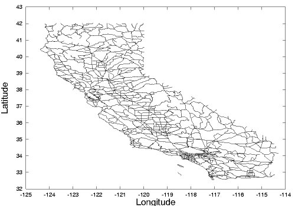

# CS225 Final Project: The Complete California Experience

  <a href="#Data">Data</a> •
  <a href="#Repo Structure">Repo Structure</a> •
  <a href="#Running Instructions">Running Instructions</a> •
  <a href="#Team">Team</a>

  

## Data

We are using the [California Road Network and Points of Interest](https://www.cs.utah.edu/~lifeifei/SpatialDataset.htm) data and focusing on the following two files:

- [California Road Network's Nodes (Node ID, Longitude, Latitude)](https://www.cs.utah.edu/~lifeifei/research/tpq/cal.cnode)
- [California Road Network's Edges (Edge ID, Start Node ID, End Node ID, L2 Distance)](https://www.cs.utah.edu/~lifeifei/research/tpq/cal.cedge)

## Repo Structure

This is a biggie. Work in Progress.

## Running Instructions

Make sure you are running the program in [Docker](https://www.docker.com/). If not, follow [This Guide](https://courses.engr.illinois.edu/cs225/sp2022/resources/own-machine/) to get started.

### Executable

To use our Complete California Experience program, run `make` then `./main` in the root directory. Follow the instructions of our program and you are good to go!

We call all the functions in `main.cpp` for you (through a fleshed-out `utils.cpp` that will print clear instructions on what your user input should be). The required inputs for each of the functionality are as follows:

1. GPS:
   - Input: starting node number and ending node number (both should be integer between 0 and 21047)
   - Output: the shortest path (nodes it passes through) and the distance of the shortest path (in km)
   - PNG Output: `californiaShortestPath.png` that outlines the shortest path on the California map constructed from our nodes
2. Tour:
   - Input: an integer within the given bounds (currently it's 1-3)
   - Output: the node numbers, based on our colorability algorithm, that correspond to your given input and represent places you should visit
3. Nearest Attraction:
   - Input: longitude (-124.389343 ~ -114.294258) and latitude (32.541302 ~ 42.017231) of the place you are at
   - Output: a latitude - longitude pair that indicates a California attraction that is closest to your current location

In addition to the above overarching functions that are called in `main.cpp`, we also have clear input and output definitions in the comments for each small functions, so you can always refer to those.

### Tests

To run the test cases, run `make test` then `./test` in the root directory.

We constructed several small to medium sized datasets in [`/data`](https://github-dev.cs.illinois.edu/cs225-sp22/ruoranz2-gracewz2-elliepc2/tree/main/data) directory, which are used as test cases to evaluate if the output of our algorithms are as expected. We also tested for edge cases such as when the graph is not fully connected. Our tests focus on testing the functionality of graph construction, Djikstra's algorithm, Welsh-Powell algorithm, and KD Tree construction.

## Team

We are TreeLovers who love California: 

- Ellie Chang (`elliepc2`)
- Grace Zhang (`gracewz2`)
- Zora Zhang (`ruoranz2`)
